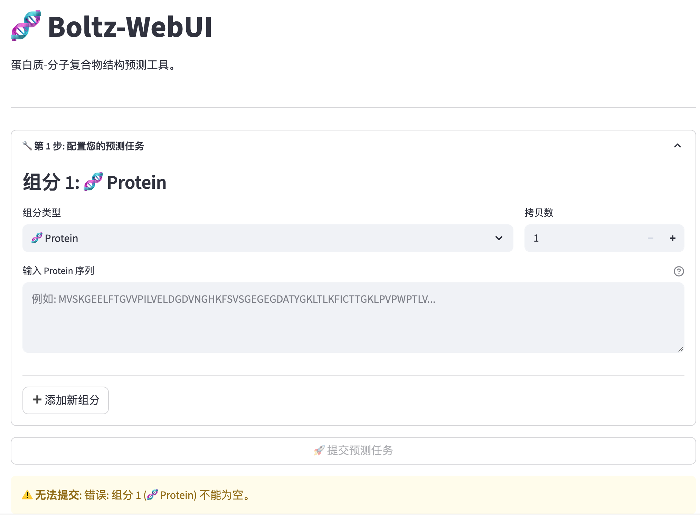

# Boltz-WebUI

**Boltz-WebUI** 是一个为 `boltz-2` 结构预测工具开发的 Web 应用。本项目通过整合 Streamlit 前端、Flask API 以及 Celery 任务队列，将 `boltz-2` 的预测流程封装成一个完整的服务。用户可以通过网页提交预测任务，系统后端会自动处理任务排队、多 GPU 并行计算以及结果的统一管理，目的是帮助使用者更方便地运行预测，并有效利用计算资源。



## 目录 (Table of Contents)

- [核心特性 (Features)](#核心特性-features)
- [安装部署 (Installation)](#安装部署-installation)
  - [第 5 步：AlphaFold3 推理环境配置（可选）](#第-5-步alphafold3-推理环境配置可选)
    - [AlphaFold3 数据库/模型获取](#alphafold3-数据库模型获取)
- [使用指南 (Usage)](#使用指南-usage)
  - [启动平台服务](#启动平台服务)
  - [通过 API 使用 (高级)](#通过-api-使用-高级)
  - [AlphaFold3 Docker 推理集成](#alphafold3-docker-推理集成)
  - [AlphaFold3 后端使用示例](#alphafold3-后端使用示例)
  - [任务监控与系统管理](#任务监控与系统管理)
  - [系统服务管理](#系统服务管理)
  - [自动化监控特性](#自动化监控特性)
- [故障排除 (Troubleshooting)](#故障排除-troubleshooting)

## 核心特性 (Features)

  * **🚀 智能任务调度**

      * 内置高/低双优先级队列，自动优先处理来自 Web 界面提交的交互式任务，确保流畅的用户体验。

  * **⚡️ 并行 GPU 集群管理**

      * 自动发现并管理服务器上的所有 GPU 资源，通过并发线程池将计算任务均匀地分配到每一块 GPU 上，实现真正的并行计算。

  * **🔐 全方位 API 安全**

      * 核心 API 端点均受 API 令牌保护，确保只有授权用户和应用才能访问计算资源。

  * **🎨 交互式结果分析**

      * 无需下载，直接在浏览器中渲染可交互的 3D 结构。支持按 pLDDT、链、二级结构等多种方案着色，并可与关键评估指标（pTM, ipTM 等）联动分析。

  * **🖱️ 一键式任务提交**

      * 用户无需关心复杂的命令行参数，只需在网页上填写序列、选择目标，即可一键提交预测任务。

  * **🔍 智能监控系统**

      * 内置自动化任务监控，实时检测卡死任务和异常状态，自动释放被占用的GPU资源，确保系统高可用性和资源利用效率。

  * **💾 智能MSA缓存**

      * 为每个蛋白质组分单独缓存MSA数据，显著加速重复预测。下载的结果包含完整的MSA缓存文件（.a3m格式），便于后续分析和重复使用。

  * **🧬 智能分子设计**

      * 集成进化算法的多肽设计功能，支持线性肽、糖肽、双环肽的从头设计。配备智能约束系统，可为自动生成的结合肽设置Contact、Bond、Pocket等约束条件，精确控制分子间相互作用。

  * **📦 完整结果归档**

      * 预测结果自动打包为zip文件，包含结构预测文件和对应的MSA缓存文件，提供完整的分析数据包。

  * **🧪 AlphaFold3 支持**

      * 支持将同一份 YAML 输入转换为 AlphaFold3 兼容的 FASTA/JSON/MSA 数据，并在配置好 Docker 环境后直接调用官方 AlphaFold3 推理；最终返回的 ZIP 同时包含模型输出与（可选）Boltz 亲和力分析结果。

## 视频演示 (Video Demo)
[https://www.bilibili.com/video/BV1tcYWz1E7f/](https://www.bilibili.com/video/BV1tcYWz1E7f/)

## 安装部署 (Installation)

#### **第 1 步：环境准备**

确保您的服务器满足以下条件：

  * 操作系统：Linux
  * Python 版本：3.9+
  * 硬件：NVIDIA GPU
  * 依赖软件：CUDA Toolkit, Docker

#### **第 2 步：获取代码与安装依赖**

```bash
# 克隆仓库
git clone https://github.com/dahuilangda/Boltz-WebUI.git
cd Boltz-WebUI

# 创建并激活 Python 虚拟环境
python3 -m venv venv
source venv/bin/activate

# 安装所有必需的 Python 包
pip install -r requirements.txt -i https://pypi.tuna.tsinghua.edu.cn/simple

# 赋予启动脚本执行权限
chmod +x run.sh
```

#### **第 3 步：启动 Redis**

使用 Docker 启动 Redis 服务，它将作为 Celery 的消息代理 (Broker)。

```bash
docker run -d -p 6379:6379 --name boltz-webui-redis redis:latest
```

#### **第 4 步：平台配置**

编辑根目录下的 `config.py` 文件：

1.  `RESULTS_BASE_DIR`: 确认结果存储路径存在且有写入权限。
2.  `MAX_CONCURRENT_TASKS`: 根据您的 GPU 数量和显存大小设置最大并发任务数。
3.  `GPU_DEVICE_IDS`: （可选）通过逗号或空格指定允许被调度的 GPU ID，如 `GPU_DEVICE_IDS="0,2,3"`。不设置时默认自动探测全部 GPU。
4.  `MSA_SERVER_MODE`: （可选）根据 MSA 服务配置选择模式，如 `colabfold`、`mmseqs2-uniref` 等。
5.  `COLABFOLD_JOBS_DIR`: （可选）ColabFold 服务器在宿主机上的任务缓存目录，用于新提供的清理接口。
6.  `VIRTUAL_SCREENING_OUTPUT_DIR`: （可选）虚拟筛选任务的本地输出目录（默认 `/data/boltz_virtual_screening_results`）。
7.  `LEAD_OPTIMIZATION_OUTPUT_DIR`: （可选）Lead optimization 任务的本地输出目录（默认 `/data/boltz_lead_optimization_results`）。
8.  `BOLTZ_API_TOKEN`: 设置一个复杂的安全令牌。**强烈建议**通过环境变量进行配置以提高安全性。

#### **第 5 步：AlphaFold3 推理环境配置（可选）**

若希望在平台内直接运行 AlphaFold3 推理，请在启动 Celery Worker 之前准备好模型/数据库资源并设置以下环境变量：

```bash
# 示例：拉取官方发布镜像
docker pull cford38/alphafold3:latest

export ALPHAFOLD3_MODEL_DIR=/data/alphafold3/models
export ALPHAFOLD3_DATABASE_DIR=/data/alphafold3/public_databases
# 推荐显式指定镜像名称
export ALPHAFOLD3_DOCKER_IMAGE=cford38/alphafold3
export ALPHAFOLD3_DOCKER_EXTRA_ARGS="--env TF_FORCE_UNIFIED_MEMORY=1 --shm-size=16g"
```

- `ALPHAFOLD3_MODEL_DIR` 与 `ALPHAFOLD3_DATABASE_DIR` 必须指向宿主机存在且可读的目录，否则任务会立即失败。
- 未显式设置 `ALPHAFOLD3_DOCKER_IMAGE` 时默认使用 `alphafold3` 镜像；建议设置为 `cford38/alphafold3` 或您自己的镜像名称。
- `ALPHAFOLD3_DOCKER_EXTRA_ARGS` 可传递代理、共享内存、调试标志等附加参数。
- 建议将上述导出语句写入 `~/.bashrc` 或 supervisor/systemd 环境配置，确保 `run.sh`、Celery worker 与监控进程都能读取。
- 若只需要导出 AlphaFold3 输入文件而不运行容器，可跳过此步骤。
- 更多细节请参考下文 [AlphaFold3 Docker 推理集成](#alphafold3-docker-推理集成)。

### AlphaFold3 数据库/模型获取

> **重要**：AlphaFold3 官方模型参数需按 DeepMind 提供的流程申请；本节仅说明公开数据库的下载位置。模型权重请按官方条款获取并放入 `ALPHAFOLD3_MODEL_DIR`。

**目录结构期望**（与容器默认路径一致）：

```
<ALPHAFOLD3_MODEL_DIR>/params/...
<ALPHAFOLD3_DATABASE_DIR>/uniref90_2022_05.fa
<ALPHAFOLD3_DATABASE_DIR>/uniprot_all_2021_04.fa
<ALPHAFOLD3_DATABASE_DIR>/mgy_clusters_2022_05.fa
<ALPHAFOLD3_DATABASE_DIR>/bfd-first_non_consensus_sequences.fasta
<ALPHAFOLD3_DATABASE_DIR>/pdb_seqres_2022_09_28.fasta
<ALPHAFOLD3_DATABASE_DIR>/pdb_2022_09_28_mmcif_files.tar
```

**快速下载示例（公开库）**

> 请预留 ~3TB 磁盘空间；以下链接来自 AF3 官方文档/AF2 常用镜像站。下载完成后校验大小/哈希，确保文件未损坏。

```bash
# 创建目标目录
export ALPHAFOLD3_DATABASE_DIR=/data/AF3_DATABASE
mkdir -p "$ALPHAFOLD3_DATABASE_DIR"

cd "$ALPHAFOLD3_DATABASE_DIR"

# UniRef90 2022_05
wget https://storage.googleapis.com/alphafold3/UniRef90/uniref90_2022_05.fa.gz
gunzip uniref90_2022_05.fa.gz

# UniProt 2021_04
wget https://storage.googleapis.com/alphafold3/UniProt/uniprot_all_2021_04.fa.gz
gunzip uniprot_all_2021_04.fa.gz

# Mgnify clusters 2022_05
wget https://storage.googleapis.com/alphafold3/Mgnify/mgy_clusters_2022_05.fa.gz
gunzip mgy_clusters_2022_05.fa.gz

# BFD (first non-consensus)
wget https://storage.googleapis.com/alphafold3/BFD/bfd-first_non_consensus_sequences.fasta.gz
gunzip bfd-first_non_consensus_sequences.fasta.gz

# PDB seqres and mmCIF tar (2022-09-28 snapshot)
wget https://storage.googleapis.com/alphafold3/PDB/pdb_seqres_2022_09_28.fasta.gz
gunzip pdb_seqres_2022_09_28.fasta.gz
wget https://storage.googleapis.com/alphafold3/PDB/pdb_2022_09_28_mmcif_files.tar

# 可选：RNA/Rfam 数据库（若使用 RNA 序列）
wget https://storage.googleapis.com/alphafold3/RNA/nt_rna_2023_02_23_clust_seq_id_90_cov_80_rep_seq.fasta.gz
gunzip nt_rna_2023_02_23_clust_seq_id_90_cov_80_rep_seq.fasta.gz
wget https://storage.googleapis.com/alphafold3/RNA/rfam_14_9_clust_seq_id_90_cov_80_rep_seq.fasta.gz
gunzip rfam_14_9_clust_seq_id_90_cov_80_rep_seq.fasta.gz
wget https://storage.googleapis.com/alphafold3/RNA/rnacentral_active_seq_id_90_cov_80_linclust.fasta.gz
gunzip rnacentral_active_seq_id_90_cov_80_linclust.fasta.gz
```

下载完成后：

```bash
ls -lh $ALPHAFOLD3_DATABASE_DIR
```

确保上述关键文件存在且非零大小；缺失会导致 AF3 数据管线在 jackhmmer/hmmsearch 阶段直接失败。建议为数据库目录设置只读权限，避免误删。

## 使用指南 (Usage)

### **启动平台服务**

#### **方式一：统一启动 (推荐生产环境)**

**简单一键启动所有服务 (包含自动监控):**

```bash
# 设置环境变量
export BOLTZ_API_TOKEN='your-super-secret-and-long-token'

# 开发模式：后端后台运行，前端前台运行（推荐）
bash run.sh dev

# 或者生产模式：全部后台运行
bash run.sh all
```

服务全部启动后，在浏览器中访问 `http://<您的服务器IP>:8501` 即可开始使用。

**注意**: 
- `bash run.sh dev` 模式下，前端在前台运行便于查看日志，按 Ctrl+C 可停止前端
- `bash run.sh all` 模式下，所有服务都在后台运行，使用 `bash run.sh stop` 停止

#### **方式二：分组件启动 (开发调试)**

您需要打开 **6 个**独立的终端窗口来分别运行平台的不同组件。在**每一个**窗口中都必须能访问到 `BOLTZ_API_TOKEN` 环境变量。

**首先，设置环境变量 (在每个终端中或在 `.bashrc`/`.zshrc` 中设置):**

```bash
export BOLTZ_API_TOKEN='your-super-secret-and-long-token'
```

1.  **终端 1 - 初始化 GPU 池** (每次冷启动服务前执行一次):

    ```bash
    bash run.sh init
    ```

2.  **终端 2 - 启动 Celery 计算节点**:

    ```bash
    bash run.sh celery
    ```

3.  **终端 3 - 启动 Flask API 服务器**:

    ```bash
    bash run.sh flask
    ```

4.  **终端 4 - 启动任务监控系统**:

    ```bash
    bash run.sh monitor
    ```

5.  **终端 5 - 启动 Streamlit 前端界面**:

    ```bash
    bash run.sh frontend
    ```

6.  **终端 6 - 监控系统状态** (可选):

    ```bash
    # 实时查看系统状态
    bash run.sh status
    
    # 或监控日志
    tail -f flask.log
    ```

### **通过 API 使用 (高级)**

大多数 API 端点都需要在 HTTP 请求头中提供身份验证令牌：`X-API-Token: <您的令牌>`。

#### **提交预测任务**

  * **端点**: `POST /predict`
  * **认证**: 需要 API 令牌
  * **常用字段**:
    * `yaml_file`: 预测所需的 YAML 配置文件（必填）
    * `use_msa_server`: 是否调用外部 MSA 服务 (`true`/`false`)
    * `backend`（可选）:
      * `boltz`（默认）: 运行原有的 Boltz 结构预测流程
      * `alphafold3`: 在配置好 AlphaFold3 环境后自动生成 FASTA/JSON/MSA 并触发 Docker 推理；若未配置相关环境变量，则仅导出输入文件
  * **示例**:
    ```bash
    curl -X POST \
         -H "X-API-Token: your-secret-token" \
         -F "yaml_file=@/path/to/your/input.yaml" \
         -F "use_msa_server=true" \
         -F "backend=alphafold3" \
         http://127.0.0.1:5000/predict
    ```
  * **说明**:
    * 前端页面的「选择预测后端」选项会自动填充同名字段；在环境配置完整时，下载的结果 zip 会包含 `af3/` 目录（含 `af3_input.fasta`、`fold_input.json`、`msa/` 与 Docker 输出），可直接交给官方 AF3 流程使用。
    * 当 `alphafold3` 后端的 YAML 同时声明 `affinity` 属性时，系统会额外运行一遍 Boltz 的亲和力流程，产出的结构/亲和力分析将被复制到 AF3 结果目录中并随 zip 一并返回。

#### **虚拟筛选 API**

  * **提交任务**: `POST /api/virtual_screening/submit`
  * **状态查询**: `GET /api/virtual_screening/status/<task_id>`
  * **结果下载**: `GET /api/virtual_screening/results/<task_id>`
  * **认证**: 需要 API 令牌
  * **必填字段**:
    * `target_file`: 目标蛋白 YAML 配置文件
    * `library_file`: 分子库文件（FASTA/SDF/CSV/SMILES 等）
  * **常用可选字段**:
    * `library_type`: `peptide` / `small_molecule` / `auto`
    * `max_molecules`, `batch_size`, `max_workers`, `timeout`, `retry_attempts`
    * `use_msa_server`: `true` / `false`
    * `binding_affinity_weight`, `structural_stability_weight`, `confidence_weight`
    * `min_binding_score`, `top_n`
    * `report_only`, `enable_affinity`, `auto_enable_affinity`, `force`, `dry_run`
    * `log_level`: `DEBUG` / `INFO` / `WARNING` / `ERROR`
    * `priority`: `high` / `default`
    * `task_timeout`: 任务总超时时间（秒）
  * **提交示例**:
    ```bash
    curl -X POST \
         -H "X-API-Token: your-secret-token" \
         -F "target_file=@/path/to/target.yaml" \
         -F "library_file=@/path/to/library.sdf" \
         -F "library_type=small_molecule" \
         -F "batch_size=32" \
         -F "use_msa_server=true" \
         http://127.0.0.1:5000/api/virtual_screening/submit
    ```
  * **状态示例**:
    ```bash
    curl -H "X-API-Token: your-secret-token" \
         http://127.0.0.1:5000/api/virtual_screening/status/<task_id>
    ```
  * **返回示例（节选）**:
    ```json
    {
      "task_id": "xxxx",
      "state": "PROGRESS",
      "progress": {
        "completed_molecules": 120,
        "total_molecules": 500,
        "progress_percent": 24.0,
        "estimated_remaining_seconds": 3600,
        "estimated_completion_time": "2025-01-01T12:30:00"
      }
    }
    ```

#### **Lead Optimization API**

  * **提交任务**: `POST /api/lead_optimization/submit`
  * **状态查询**: `GET /api/lead_optimization/status/<task_id>`
  * **结果下载**: `GET /api/lead_optimization/results/<task_id>`
  * **认证**: 需要 API 令牌
  * **必填字段**:
    * `target_config`: 目标蛋白 YAML 配置文件
    * `input_compound` 或 `input_file` 二选一
  * **常用可选字段**:
    * `optimization_strategy`: `scaffold_hopping` / `fragment_replacement` / `multi_objective`
    * `max_candidates`, `iterations`, `batch_size`, `top_k_per_iteration`
    * `diversity_weight`, `similarity_threshold`, `max_similarity_threshold`
    * `diversity_selection_strategy`, `max_chiral_centers`
    * `generate_report`, `verbosity`
    * `priority`, `task_timeout`
  * **提交示例（单化合物）**:
    ```bash
    curl -X POST \
         -H "X-API-Token: your-secret-token" \
         -F "target_config=@/path/to/target.yaml" \
         -F "input_compound=CC(=O)Oc1ccccc1C(=O)O" \
         -F "optimization_strategy=scaffold_hopping" \
         -F "max_candidates=50" \
         -F "iterations=2" \
         http://127.0.0.1:5000/api/lead_optimization/submit
    ```
  * **提交示例（批量文件）**:
    ```bash
    curl -X POST \
         -H "X-API-Token: your-secret-token" \
         -F "target_config=@/path/to/target.yaml" \
         -F "input_file=@/path/to/compounds.csv" \
         -F "max_candidates=30" \
         http://127.0.0.1:5000/api/lead_optimization/submit
    ```
  * **状态示例**:
    ```bash
    curl -H "X-API-Token: your-secret-token" \
         http://127.0.0.1:5000/api/lead_optimization/status/<task_id>
    ```
  * **返回示例（节选）**:
    ```json
    {
      "task_id": "xxxx",
      "state": "PROGRESS",
      "progress": {
        "processed_candidates": 40,
        "expected_candidates": 100,
        "progress_percent": 40.0,
        "estimated_remaining_seconds": 1800,
        "estimated_completion_time": "2025-01-01T12:10:00"
      }
    }
    ```

### **AlphaFold3 Docker 推理集成**

完成 [第 5 步](#第-5-步alphafold3-推理环境配置可选) 的环境准备后，平台会在提交 `backend=alphafold3` 任务时自动调用官方 AlphaFold3 Docker 镜像执行推理。步骤如下：

1. **准备 AlphaFold3 资源**
   - 安装/拉取镜像（推荐使用 `cford38/alphafold3`，如需使用其他镜像请同步更新环境变量）。
   - 准备模型参数与公共数据库目录（官方安装指南中下载的 `models/` 与 `public_databases/`）。

2. **配置环境变量（在启动 Celery Worker 前设置）**

   ```bash
   export ALPHAFOLD3_MODEL_DIR=/path/to/models            # 路径前后不要加引号
   export ALPHAFOLD3_DATABASE_DIR=/path/to/public_databases
   # 可选：如下变量若不设置则使用默认值
   export ALPHAFOLD3_DOCKER_IMAGE=alphafold3
   export ALPHAFOLD3_DOCKER_EXTRA_ARGS="--env TF_FORCE_UNIFIED_MEMORY=1"
   ```

   说明：
   - `ALPHAFOLD3_MODEL_DIR` 与 `ALPHAFOLD3_DATABASE_DIR` **必须** 指向宿主机实际存在的目录；缺失或路径错误时任务会直接报错中止。
   - 若需要为 Docker 传递额外参数（如代理、环境变量等），可通过 `ALPHAFOLD3_DOCKER_EXTRA_ARGS` 传入。
   - Worker 启动时会为任务设置 `CUDA_VISIBLE_DEVICES`，容器将继承该 GPU 绑定。

3. **提交任务**
   - 在前端选择 “AlphaFold3（导出AF3输入）” 后端或在 API 请求中设置 `backend=alphafold3`。
   - 任务执行流程：
     1. 生成 AlphaFold3 兼容的 FASTA/JSON/MSA 输入文件。
     2. 根据上述环境变量启动 Docker 容器执行 `python run_alphafold.py`。
     3. 将容器输出复制到结果目录 `alphafold3_predictions/<jobname>/`，最终随 zip 返回。
     4. 若 YAML 请求了亲和力指标，额外运行一次 Boltz 亲和力流程并一并打包。
   - Celery 日志会打印 `🐳 运行 AlphaFold3 Docker`，可据此确认容器是否成功拉起。

### **AlphaFold3 后端使用示例**

- **前端界面**：在预测页面的「选择预测后端」中选择 `AlphaFold3 引擎`，其余表单与 Boltz 模式一致；任务完成后，下载的 ZIP 会在根目录附带 `af3/` 文件夹，包含输入文件、容器输出与（如请求）亲和力分析。
- **API 请求**：参考上节 `backend=alphafold3` 的 curl 示例；若环境变量配置正确，可在 `celery.log` 中看到 Docker 启动信息，并在 `alphafold3_predictions/<jobname>/` 下找到中间结果。
- **命令行设计器**：支持在设计流程中直接切换后端，例如 `python designer/run_design.py --yaml_template ./examples/design.yaml --backend alphafold3 --server_url http://127.0.0.1:5000 --api_token <your-token>`；其余参数与 Boltz 引擎一致。
- **结果说明**：ZIP 文件中 `af3/` 目录含 `af3_input.fasta`、`fold_input.json`、`msa/`、`output/` 以及原始 `input.yaml`，便于在外部 AlphaFold3 环境复现或继续分析。

#### **提交亲和力预测任务**

**方式一：复合物文件预测**

  * **端点**: `POST /api/affinity`
  * **认证**: 需要 API 令牌
  * **参数**:
    * `input_file`: 蛋白质-配体复合物的 PDB 或 CIF 文件。
    * `ligand_resname`: 配体在结构文件中的残基名 (例如: `LIG`, `UNK`)。
    * `priority`: 任务优先级 (`high` 或 `default`)
  * **示例**:
    ```bash
    curl -X POST \
         -H "X-API-Token: your-secret-token" \
         -F "input_file=@/path/to/your/complex.pdb" \
         -F "ligand_resname=LIG" \
         -F "priority=default" \
         http://127.0.0.1:5000/api/affinity
    ```

**方式二：分开输入蛋白质和小分子文件**

  * **端点**: `POST /api/affinity_separate`
  * **认证**: 需要 API 令牌
  * **参数**:
    * `protein_file`: 蛋白质结构文件 (PDB 或 CIF 格式)
    * `ligand_file`: 小分子结构文件 (SDF, MOL, 或 MOL2 格式)
    * `ligand_resname`: 要分配给配体的残基名 (例如: `LIG`, `UNK`)
    * `output_prefix`: 输出文件前缀 (默认: `complex`)
    * `priority`: 任务优先级 (`high` 或 `default`)
  * **示例**:
    ```bash
    curl -X POST \
         -H "X-API-Token: your-secret-token" \
         -F "protein_file=@/path/to/protein.pdb" \
         -F "ligand_file=@/path/to/ligand.sdf" \
         -F "ligand_resname=LIG" \
         -F "output_prefix=my_complex" \
         -F "priority=default" \
         http://127.0.0.1:5000/api/affinity_separate
    ```
  * **支持的文件格式**:
    * 蛋白质文件: `.pdb`, `.cif`
    * 小分子文件: `.sdf`, `.mol`, `.mol2`
  * **工作流程**:
    1. 系统自动加载小分子文件并生成3D坐标（如需要）
    2. 将蛋白质和小分子合并成完整的复合物结构
    3. 使用标准亲和力预测流程进行分析
    4. 输出预测结果到CSV文件

#### **管理任务**

  * **查看任务列表**: `GET /tasks`

      * **认证**: 需要 API 令牌
      * **描述**: 列出所有活跃 (running) 和排队中 (queued/reserved) 的任务。
      * **示例**:
        ```bash
        curl -H "X-API-Token: your-secret-token" http://127.0.0.1:5000/tasks
        ```

  * **终止任务**: `DELETE /tasks/<task_id>`

      * **认证**: 需要 API 令牌
      * **描述**: 终止一个正在运行或在队列中的任务。
      * **示例**:
        ```bash
        curl -X DELETE -H "X-API-Token: your-secret-token" http://127.0.0.1:5000/tasks/some-task-id
        ```

  * **修改任务优先级**: `POST /tasks/<task_id>/move`

      * **认证**: 需要 API 令牌
      * **描述**: 将一个排队中的任务移动到另一个队列。只对尚未开始执行的任务有效。
      * **示例**:
        ```bash
        curl -X POST \
             -H "Content-Type: application/json" \
             -H "X-API-Token: your-secret-token" \
             -d '{"target_queue": "high_priority"}' \
             http://127.0.0.1:5000/tasks/some-task-id-in-queue/move
        ```

#### **查询状态与下载结果**

这两个接口是公开的，**无需** `X-API-Token` 即可访问，方便用户和前端轮询。

  * **查询任务状态**: `GET /status/<task_id>`

      * **认证**: 无
      * **描述**: 在下载结果前，您应首先查询任务状态，确保其 `"state"` 值为 `"SUCCESS"`。
      * **示例**:
        ```bash
        curl http://127.0.0.1:5000/status/some-task-id
        ```
      * **返回示例 (成功时):**
        ```json
        {
          "task_id": "some-task-id",
          "state": "SUCCESS",
          "info": {
            "status": "Task completed successfully.",
            "gpu_id": 0,
            "result": { "message": "File uploaded successfully" }
          }
        }
        ```

  * **下载结果文件**: `GET /results/<task_id>`

      * **认证**: 无
      * **描述**: 当任务成功完成后，使用此端点下载包含所有结果的 `.zip` 压缩包。压缩包包含：
        - 预测结果文件（如 .cif, .pdb 文件）
        - MSA缓存文件（.a3m格式，位于`msa/`子目录中）- 便于后续分析和重复使用
      * **示例**:
        ```bash
        # 将结果保存为 a_specific_name.zip
        curl -o a_specific_name.zip http://127.0.0.1:5000/results/some-task-id

        # 或者使用 -J -O 让 curl 自动使用服务器提供的文件名 (e.g., some-task-id_results.zip)
        curl -J -O http://127.0.0.1:5000/results/some-task-id
        ```

    如果文件不存在或任务未完成，将返回 404 Not Found 错误。

#### **MSA 缓存管理**

系统支持 MSA（Multiple Sequence Alignment）智能缓存，为每个蛋白质组分单独缓存 MSA 数据，显著加速重复预测。

  * **获取缓存统计**: `GET /api/msa/cache/stats`

      * **认证**: 需要 API 令牌
      * **描述**: 获取 MSA 缓存的统计信息，包括文件数量、总大小、最早和最新文件时间。
      * **示例**:
        ```bash
        curl -H "X-API-Token: your-secret-token" http://127.0.0.1:5000/api/msa/cache/stats
        ```

  * **智能清理缓存**: `POST /api/msa/cache/cleanup`

      * **认证**: 需要 API 令牌
      * **描述**: 自动清理过期缓存文件（超过7天）和超量缓存文件（超过5GB），返回清理统计。
      * **示例**:
        ```bash
        curl -X POST -H "X-API-Token: your-secret-token" http://127.0.0.1:5000/api/msa/cache/cleanup
        ```

  * **清空全部缓存**: `POST /api/msa/cache/clear`

      * **认证**: 需要 API 令牌
      * **描述**: 清空所有 MSA 缓存文件。谨慎使用！
      * **示例**:
        ```bash
        curl -X POST -H "X-API-Token: your-secret-token" http://127.0.0.1:5000/api/msa/cache/clear
        ```

  * **清理 ColabFold 服务器缓存**: `POST /api/colabfold/cache/clear`

      * **认证**: 需要 API 令牌
      * **描述**: 删除本地 ColabFold 服务器在 `COLABFOLD_JOBS_DIR` 中积累的历史任务（包括子目录及临时文件）。
      * **返回值**: 成功删除的条目数、释放空间、以及清理失败的条目（包含错误原因）。当全部条目可写且删除完成时 `success=true`，若存在权限问题等导致部分失败，HTTP 状态码为 `207` 且 `failed_items` 会给出详细说明。
      * **示例**:
        ```bash
        curl -X POST -H "X-API-Token: your-secret-token" http://127.0.0.1:5000/api/colabfold/cache/clear
        ```

#### **ColabFold 服务器缓存**

若在本地部署了 ColabFold MSA 服务器，系统会在 `colabfold_server/jobs` 目录（或通过环境变量 `COLABFOLD_JOBS_DIR` 指定的自定义路径）中存储任务数据。每个任务都会创建一个以唯一标识符命名的子目录，包含：

- **job.fasta**: 输入的蛋白质序列文件
- **uniref.a3m**: MSA（多序列比对）结果文件
- **pdb70.m8**: PDB数据库搜索结果
- **mmseqs_results_*.tar.gz**: MMseqs2压缩结果包
- **job.json**: 任务元数据和配置信息

**缓存管理方式**：

1. **查看目录占用**：
   ```bash
   du -sh $COLABFOLD_JOBS_DIR  # 查看总体积占用
   ls -la $COLABFOLD_JOBS_DIR  # 查看任务数量和详情
   ```

2. **API清理接口**：使用 `POST /api/colabfold/cache/clear` 接口进行安全清理
   - 自动统计释放空间和删除的条目数
   - 返回清理失败的条目及错误原因
   - 支持权限问题的诊断和处理建议

3. **权限设置**：如果Docker容器以root用户运行，可能需要调整权限：
   ```bash
   sudo chown -R $(whoami):$(whoami) $COLABFOLD_JOBS_DIR
   ```

4. **Docker配置**：在 `colabfold_server/docker-compose.yml` 中确保正确的卷映射：
   ```yaml
   volumes:
     - ${JOBS_DIR:-./jobs}:/app/jobs
   ```

**注意事项**：
- 清理操作会删除所有历史任务数据，包括MSA缓存和计算结果
- 建议在清理前确认没有正在运行的ColabFold任务
- 任务目录中的 `.a3m` 文件可用于加速后续的相同或相似序列的预测
- 可以通过环境变量 `COLABFOLD_JOBS_DIR` 自定义存储路径，便于集中管理和备份

#### **任务监控与系统管理**

系统集成了智能任务监控功能，能够自动检测和清理卡死任务，释放被占用的GPU资源。监控系统通过API端点提供服务，支持自动化运维。

  * **系统健康检查**: `GET /monitor/health`

      * **认证**: 无需认证
      * **描述**: 快速检查系统整体健康状态，包括GPU可用性和卡死任务统计。
      * **示例**:
        ```bash
        curl http://127.0.0.1:5000/monitor/health
        ```
      * **返回示例**:
        ```json
        {
          "healthy": true,
          "gpu_available": 4,
          "gpu_in_use": 2,
          "stuck_tasks_count": 0,
          "timestamp": "2025-01-15T10:30:00"
        }
        ```

  * **详细状态查询**: `GET /monitor/status`

      * **认证**: 需要 API 令牌
      * **描述**: 获取系统详细状态，包括所有运行中任务的信息和卡死任务的详细诊断。
      * **示例**:
        ```bash
        curl -H "X-API-Token: your-secret-token" http://127.0.0.1:5000/monitor/status
        ```
      * **返回内容**: GPU状态、运行中任务列表、卡死任务诊断、系统时间戳等。

  * **智能任务清理**: `POST /monitor/clean`

      * **认证**: 需要 API 令牌
      * **描述**: 自动检测并清理卡死任务，释放被占用的GPU资源。可选择性清理指定任务或自动清理所有问题任务。
      * **参数**:
        - `force` (boolean): 是否强制终止进程
        - `task_ids` (array): 指定要清理的任务ID列表（可选）
      * **示例**:
        ```bash
        # 自动清理所有卡死任务
        curl -X POST \
             -H "X-API-Token: your-secret-token" \
             -H "Content-Type: application/json" \
             -d '{"force": false}' \
             http://127.0.0.1:5000/monitor/clean
        
        # 清理指定任务
        curl -X POST \
             -H "X-API-Token: your-secret-token" \
             -H "Content-Type: application/json" \
             -d '{"task_ids": ["task-id-1", "task-id-2"], "force": true}' \
             http://127.0.0.1:5000/monitor/clean
        ```

  * **紧急清理**: `POST /monitor/kill-all`

      * **认证**: 需要 API 令牌
      * **描述**: 紧急情况下强制清理所有正在运行的任务。请谨慎使用！
      * **参数**:
        - `force` (boolean): 强制终止所有进程（默认为true）
      * **示例**:
        ```bash
        curl -X POST \
             -H "X-API-Token: your-secret-token" \
             -H "Content-Type: application/json" \
             -d '{"force": true}' \
             http://127.0.0.1:5000/monitor/kill-all
        ```

### **系统服务管理**

为了简化运维管理，系统提供了统一的服务管理脚本 `run.sh`，支持一键启动、停止和监控所有服务组件（包括前端界面）。

#### **快速启动模式**

```bash
# 开发模式：后端服务在后台运行，前端在前台运行（推荐开发使用）
bash run.sh dev

# 生产模式：所有服务在后台运行（推荐生产环境）  
bash run.sh all

# 停止所有服务
bash run.sh stop
```

#### **分组件启动 (开发调试)**

```bash
# 1. 初始化GPU池
bash run.sh init

# 2. 启动API服务器
bash run.sh flask

# 3. 启动工作进程
bash run.sh celery

# 4. 启动前端界面
bash run.sh frontend

# 5. 启动监控守护进程
bash run.sh monitor
```

#### **服务状态监控**

```bash
# 查看系统整体状态
bash run.sh status

# 手动触发任务清理
bash run.sh clean

# 实时监控日志
tail -f flask.log      # API服务器日志
tail -f celery.log     # 工作进程日志
tail -f monitor.log    # 监控系统日志
tail -f streamlit.log  # 前端界面日志
```

#### **可用命令列表**

| 命令 | 说明 | 适用场景 |
|------|------|----------|
| `bash run.sh dev` | 开发模式启动（前端前台运行） | 开发调试 |
| `bash run.sh all` | 生产模式启动（全后台运行） | 生产部署 |
| `bash run.sh frontend` | 仅启动前端界面 | 前端开发 |
| `bash run.sh flask` | 仅启动API服务器 | 后端调试 |
| `bash run.sh celery` | 仅启动工作进程 | 任务处理测试 |
| `bash run.sh monitor` | 仅启动监控守护进程 | 系统监控 |
| `bash run.sh status` | 查看所有服务状态 | 运维监控 |
| `bash run.sh clean` | 手动清理问题任务 | 故障恢复 |
| `bash run.sh stop` | 停止所有服务 | 系统维护 |

#### **访问地址**

启动成功后，可通过以下地址访问：
- **Web界面**: http://localhost:8501
- **API服务**: http://localhost:5000  
- **Redis服务**: localhost:6379

### **自动化监控特性**

#### **智能检测机制**

系统每5分钟自动执行健康检查，检测以下异常情况：

- **长时间运行**: 任务运行时间超过3小时
- **进程卡死**: 任务无进展时间超过30分钟
- **状态异常**: 任务已失败但GPU未释放
- **进程丢失**: 任务进程不存在但状态显示运行中

#### **自动恢复操作**

发现异常时，监控系统会自动执行：

1. 撤销Celery任务
2. 终止相关进程
3. 释放被占用的GPU资源
4. 清理Redis中的任务记录
5. 记录详细的操作日志

#### **监控配置**

监控系统的关键参数可以通过修改 `api_server.py` 中的 `TaskMonitor` 类进行调整：

```python
self.max_task_duration = timedelta(hours=3)      # 最长允许运行时间
self.max_stuck_duration = timedelta(minutes=30) # 无进展的最长时间
```

## 故障排除 (Troubleshooting)

### **GPU资源被占用无法释放**

这是最常见的问题，通常由任务异常终止或进程卡死导致。

**解决方案**:

```bash
# 方法1: 使用集成监控系统（推荐）
bash run.sh status  # 检查系统状态
bash run.sh clean   # 自动清理问题任务

# 方法2: 通过API接口
curl http://localhost:5000/monitor/health  # 检查健康状态
curl -X POST -H "X-API-Token: your-token" \
     -H "Content-Type: application/json" \
     -d '{"force": false}' \
     http://localhost:5000/monitor/clean

# 方法3: 紧急情况使用独立工具
python3 task_monitor.py status
python3 task_monitor.py clean
python3 task_monitor.py kill-all --force  # 强制清理
```

### **服务启动失败**

**常见原因及解决方案**:

1. **Redis未启动**:
   ```bash
   docker run -d -p 6379:6379 --restart unless-stopped --name boltz-webui-redis redis:latest
   ```

2. **GPU池未初始化**:
   ```bash
   bash run.sh init
   ```

3. **端口被占用**:
   ```bash
   # 检查端口占用
   lsof -i :5000  # Flask API
   lsof -i :8501  # Streamlit
   
   # 终止占用进程
   bash run.sh stop
   ```

4. **权限问题**:
   ```bash
   # 确保结果目录有写入权限
   chmod 755 /path/to/results
   
   # 确保脚本有执行权限
   chmod +x run.sh
   ```

### **任务处理异常**

**症状**: 任务提交后长时间处于PENDING状态或突然失败。

**排查步骤**:

1. **检查Celery工作进程**:
   ```bash
   bash run.sh status
   tail -f celery.log
   ```

2. **检查GPU可用性**:
   ```bash
   nvidia-smi
   bash run.sh status
   ```

3. **检查任务详细状态**:
   ```bash
   curl -H "X-API-Token: your-token" http://localhost:5000/monitor/status
   ```

4. **清理卡死任务**:
   ```bash
   bash run.sh clean
   ```
